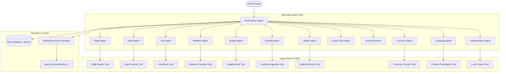

# TravelMission AI

> "Your Personal AI Travel Operations Center."

A complete, production-ready, full-stack multi-agent application built using Google's **Agent Development Kit (ADK)** for Kaggle's AI Agents Capstone.

TravelMission AI coordinates a team of 12 specialized, autonomous AI agents through a centralized Orchestrator Agent. It models a professional travel agency operations desk, going far beyond typical single-turn text generators.

---

## 📖 Problem & Solution

### The Problem
Planning international trips requires juggling dozens of websites for flights, hotels, visa regulations, weather warnings, budget tracking, packing lists, local customs, and routes. Standard LLM chatbots simply output a flat, generic text itinerary. They cannot coordinate specialized expertise or react to shifting conditions.

### The Solution: Multi-Agent Collaboration
TravelMission AI models travel planning as a **collaborative mission**. It deploys 12 specialized agents, each possessing unique roles, instructions, memories, and tools. When one agent encounters a constraint (e.g., the Weather Agent flags heavy rain on Day 3), it propagates this condition through the Orchestrator, prompting:
1. The **Packing Agent** to add rain protection gear to the checklist.
2. The **Activity Planner** to swap outdoor sightseeing for indoor museums.
3. The **Budget Agent** to recalculate ticket prices.
4. The **Hotel Agent** to suggest indoor points-of-interest near the lodging.

---

## 🏛️ System Architecture



---

## 📂 Folder Structure

```
travel-mission-ai/
├── backend/                   # FastAPI + Google ADK Backend
│   ├── app/
│   │   ├── agents/            # Definitions for the 12 specialized agents
│   │   ├── app_utils/         # Telemetry and logging config
│   │   ├── schemas/           # Pydantic input/output validation schemas
│   │   ├── skills/            # Reusable business logic (Flight, Budget, Visa skills)
│   │   ├── tools/             # Custom Function tools (PDF Brief, OCR Parser, APIs)
│   │   ├── database.py        # SQLAlchemy connections
│   │   ├── models.py          # SQLAlchemy tables (Trip, BudgetLog, Itinerary, Logs)
│   │   ├── agent.py           # Orchestrator setup & ADK callbacks
│   │   └── fast_api_app.py    # FastAPI routes, WebSockets, background runner
│   ├── tests/                 # Unit and integration test suites
│   ├── pyproject.toml         # Python packaging metadata (uv format)
│   └── Dockerfile             # Backend Python container
│
├── frontend/                  # Next.js Frontend
│   ├── src/
│   │   ├── app/               # Next.js App Router (pages, layouts, globals.css)
│   │   └── components/        # Handcrafted glassmorphic dashboard components
│   ├── package.json           # Node dependencies
│   └── Dockerfile             # Multi-stage production image
│
├── docker-compose.yml         # Container Orchestration
├── .gitignore                 # Version control exclusions
└── README.md                  # System documentation
```

---

## 🛠️ Technology Stack

* **Frontend**: Next.js (App Router), React, Tailwind CSS v4, Framer Motion (animations), Recharts (data visualizations), Lucide React (icons).
* **Backend**: Python FastAPI, Google Agent Development Kit (ADK) 2.0, Pydantic, SQLAlchemy.
* **Database**: PostgreSQL / Supabase ready (falls back to SQLite for local development).
* **DevOps**: Docker, docker-compose.

---

## 💾 Installation & Local Setup

### Prerequisites
1. [Node.js v18+](https://nodejs.org/)
2. [Python 3.11+](https://www.python.org/)
3. [uv](https://github.com/astral-sh/uv) (for rapid Python packaging)

### Run Backend
```bash
cd backend
# Install dependencies
agents-cli install
# Set API Key (Orchestrator requires Gemini API access)
export GEMINI_API_KEY="your-api-key"
# Launch backend server
uv run uvicorn app.fast_api_app:app --host 0.0.0.0 --port 8000
```

### Run Frontend
```bash
cd ../frontend
npm install
npm run dev
```
Open `http://localhost:3000` to view the Mission Control Center!

---

## 🔒 Security & Data Masking
* **Input Validation**: All API inputs are audited by Pydantic models.
* **Secure Uploads**: Document upload strictly validates content-types (PDF, JPG, PNG) and masks sensitive OCR strings like passports or flight numbers from plain logging.
* **Environment Isolation**: API keys and GCP project tokens are managed using environment variables (never committed to version control).

---

## 🐳 Container Deployment

You can build and deploy the entire multi-agent system using Docker:
```bash
docker-compose up --build
```
This boots:
* The Next.js dashboard at `http://localhost:3000`
* The FastAPI Multi-Agent Operations Center at `http://localhost:8000`

---

## 📄 License
This project is licensed under the Apache 2.0 License - see the LICENSE file for details.

## 🤝 Acknowledgements
* Google Vertex AI GenAI team for the Agent Development Kit (ADK).
* Kaggle AI Agents Intensive team.
