# TravelMission AI

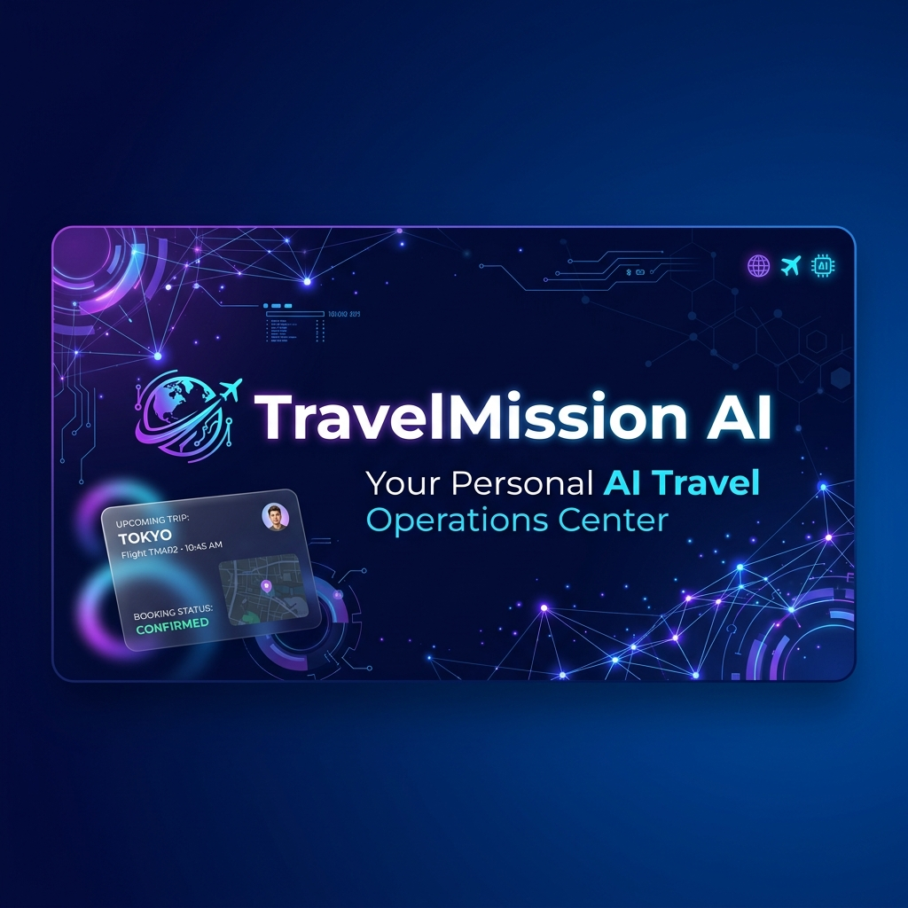

> "Your Personal AI Travel Operations Center."

A complete, production-ready, full-stack multi-agent application built using Google's **Agent Development Kit (ADK)** for Kaggle's AI Agents Capstone.

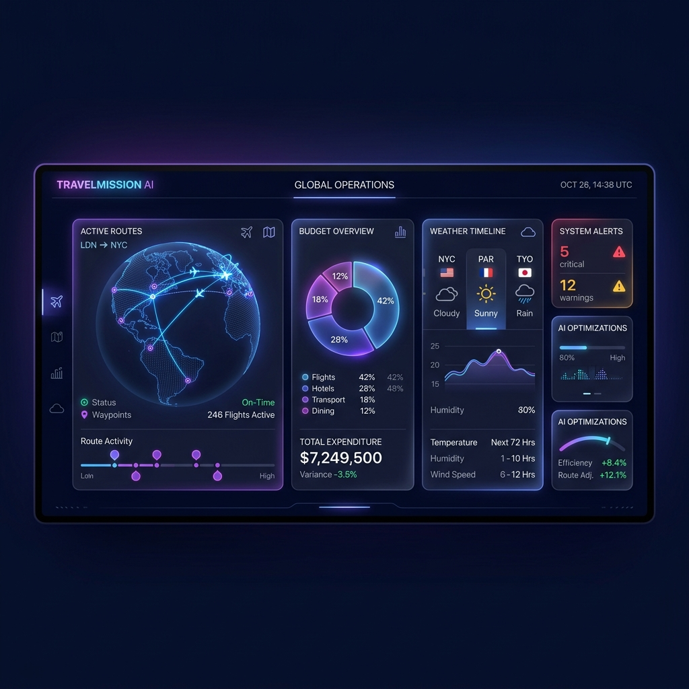

TravelMission AI coordinates a team of 12 specialized, autonomous AI agents through a centralized Orchestrator Agent. It models a professional travel agency operations desk, going far beyond typical single-turn text generators.

---

## 📖 Table of Contents
1. [Problem & Solution](#-problem--solution)
2. [Documentation Center](#-documentation-center)
3. [Technical Architecture](#-technical-architecture)
4. [Agent Workflows & Collaboration](#-agent-workflows--collaboration)
5. [MCP Integration](#-mcp-integration)
6. [Agent Skills](#-agent-skills)
7. [Deployment & Folder Structure](#-deployment--folder-structure)
8. [Installation & Setup](#-installation--setup)
9. [Security & Data Masking](#-security--data-masking)

---

## 📖 Problem & Solution

### The Problem
Planning international trips requires juggling dozens of websites for flights, hotels, visa regulations, weather warnings, budget tracking, packing lists, local customs, and routes. Standard LLM chatbots simply output a flat, generic text itinerary. They cannot coordinate specialized expertise or react to shifting conditions.

### The Solution: Multi-Agent Collaboration
TravelMission AI models travel planning as a **collaborative mission**. It deploys 12 specialized agents, each possessing unique roles, instructions, memories, and tools. When one agent encounters a constraint (e.g., the Weather Agent flags heavy rain on Day 3), it propagates this condition through the Orchestrator, prompting:
1. The **Packing Agent** to add rain protection gear to the checklist.
2. The **Activity Planner** to swap outdoor sightseeing for indoor museums.
3. The **Budget Agent** to recalculate ticket prices.
4. The **Hotel Agent** to suggest indoor points-of-interest near the lodging.

---

## 📚 Documentation Center

To dive deeper into specific components, refer to our comprehensive technical documentation:

* 🏗️ **[System Architecture](file:///c:/Users/mehra/Downloads/capstone%20project/docs/architecture.md)**: Details runtime sequences, WebSocket gateways, and DB triggers.
* 🤝 **[Agent Workflows](file:///c:/Users/mehra/Downloads/capstone%20project/docs/agent_workflows.md)**: Explains coordinator protocols, agent directives, and state updates.
* 🔌 **[MCP Integration](file:///c:/Users/mehra/Downloads/capstone%20project/docs/mcp_integration.md)**: Describes Model Context Protocol servers and filesystem sandboxing.
* 🗺️ **[User Workflow](file:///c:/Users/mehra/Downloads/capstone%20project/docs/user_workflow.md)**: Outlines the end-to-end traveler journey and tab configurations.
* 🧠 **[Agent Skills](file:///c:/Users/mehra/Downloads/capstone%20project/docs/agent_skills.md)**: Details reusable class-based backend skills.
* 📦 **[Folder Structure & Deployment](file:///c:/Users/mehra/Downloads/capstone%20project/docs/deployment.md)**: Explains file layouts and Docker compose parameters.

---

## 🏛️ Technical Architecture

### 1. Overall System Architecture

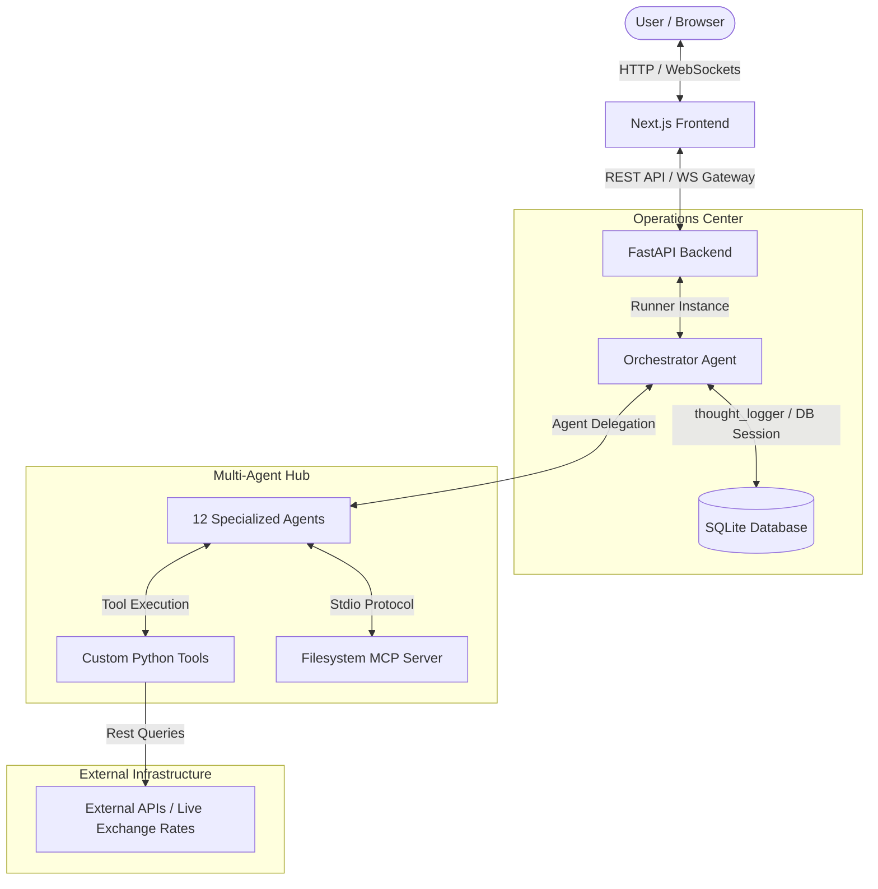
```mermaid
graph TD
    User([User / Browser]) <-->|HTTP / WebSockets| FE[Next.js Frontend]
    FE <-->|REST API / WS Gateway| BE[FastAPI Backend]
    
    subgraph Operations Center
        BE <-->|Runner Instance| Orchestrator[Orchestrator Agent]
        Orchestrator <-->|thought_logger / DB Session| DB[(SQLite Database)]
    end
    
    subgraph Multi-Agent Hub
        Orchestrator <-->|Agent Delegation| Specialists[12 Specialized Agents]
        Specialists <-->|Tool Execution| Tools[Custom Python Tools]
        Specialists <-->|Stdio Protocol| MCP[Filesystem MCP Server]
    end
    
    subgraph External Infrastructure
        Tools -->|Rest Queries| APIs[External APIs / Live Exchange Rates]
    end
```

The system architecture decouples user interface logic from agent execution. The Next.js client renders a dashboard, while the FastAPI server runs the ADK Orchestrator. The Orchestrator delegates tasks to specialized agents. The agents communicate with the database, access local files using a Filesystem MCP server, and query external APIs to fetch live weather and exchange rates.

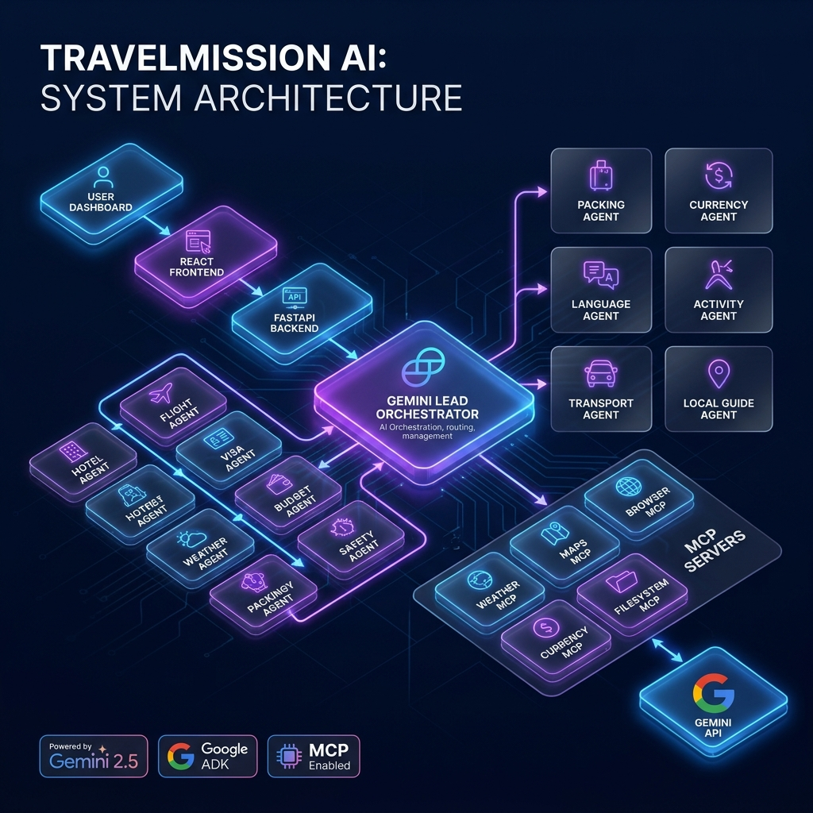

---

### 2. Event Sequence Diagram

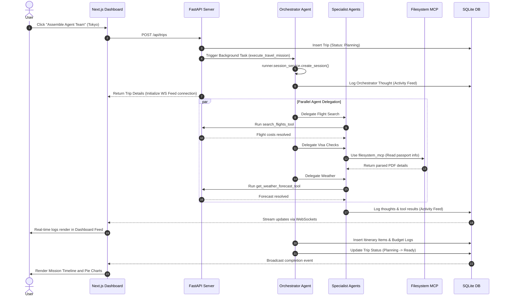
```mermaid
sequenceDiagram
    autonumber
    actor User
    participant FE as Next.js Dashboard
    participant BE as FastAPI Server
    participant ORCH as Orchestrator Agent
    participant SPEC as Specialist Agents
    participant MCP as Filesystem MCP
    participant DB as SQLite DB

    User->>FE: Click "Assemble Agent Team" (Tokyo)
    FE->>BE: POST /api/trips
    BE->>DB: Insert Trip (Status: Planning)
    BE->>ORCH: Trigger Background Task (execute_travel_mission)
    ORCH->>ORCH: runner.session_service.create_session()
    ORCH->>DB: Log Orchestrator Thought (Activity Feed)
    BE-->>FE: Return Trip Details (Initialize WS Feed connection)
    
    par Parallel Agent Delegation
        ORCH->>SPEC: Delegate Flight Search
        SPEC->>BE: Run search_flights_tool
        BE-->>SPEC: Flight costs resolved
        
        ORCH->>SPEC: Delegate Visa Checks
        SPEC->>MCP: Use filesystem_mcp (Read passport info)
        MCP-->>SPEC: Return parsed PDF details
        
        ORCH->>SPEC: Delegate Weather
        SPEC->>BE: Run get_weather_forecast_tool
        BE-->>SPEC: Forecast resolved
    end
    
    SPEC->>DB: Log thoughts & tool results (Activity Feed)
    DB-->>FE: Stream updates via WebSockets
    FE->>User: Real-time logs render in Dashboard Feed
    
    ORCH->>DB: Insert Itinerary Items & Budget Logs
    ORCH->>DB: Update Trip Status (Planning -> Ready)
    DB-->>FE: Broadcast completion event
    FE->>User: Render Mission Timeline and Pie Charts
```

The sequence diagram illustrates the lifecycle of a travel mission. The client posts parameters to initialize a session in the database. The Orchestrator launches background tasks that run agents in parallel. Every agent operation (thoughts, tools, errors) is committed to the database and streamed to the user's dashboard in real time using WebSockets.

---

### 3. Data Flow Diagram

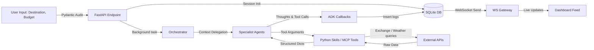
```mermaid
graph LR
    Input[User Input: Destination, Budget] -->|Pydantic Audit| API[FastAPI Endpoint]
    API -->|Session Init| DB[(SQLite DB)]
    API -->|Background task| Orchestrator[Orchestrator]
    
    Orchestrator -->|Context Delegation| Agents[Specialist Agents]
    Agents -->|Tool Arguments| Skills[Python Skills / MCP Tools]
    Skills -->|Exchange / Weather queries| External[External APIs]
    
    External -->|Raw Data| Skills
    Skills -->|Structured Dicts| Agents
    Agents -->|Thoughts & Tool Calls| Logger[ADK Callbacks]
    
    Logger -->|Insert logs| DB
    DB -->|WebSocket Send| WS[WS Gateway]
    WS -->|Live Updates| FE[Dashboard Feed]
```

The data flow diagram shows how data propagates through the system. User inputs are validated using Pydantic schemas, stored in the database, and passed to the Orchestrator. The Orchestrator delegates context to specialized agents. The agents run tools that query external APIs and return structured JSON. ADK callbacks record the step logs in the database, triggering the WebSocket gateway to update the client's feed.

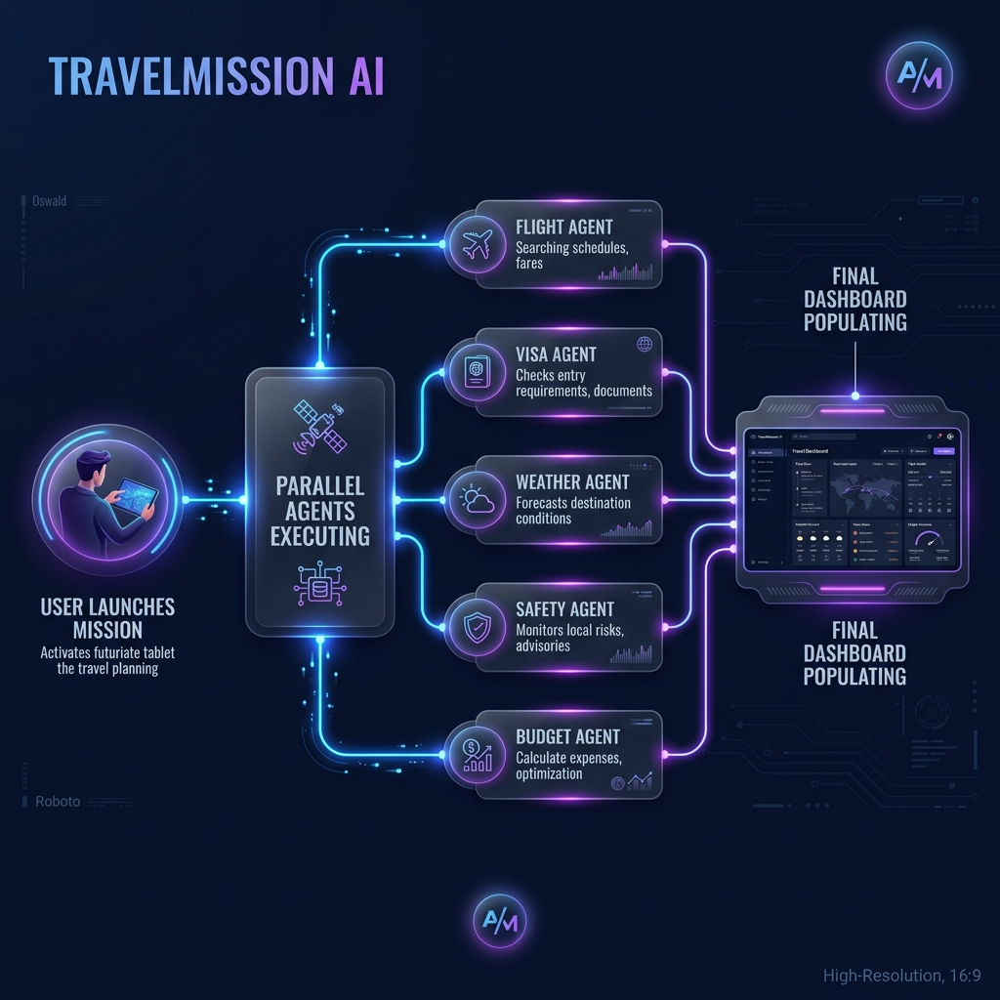

---

## 🤝 Agent Workflows & Collaboration

### 4. Multi-Agent Communication Diagram

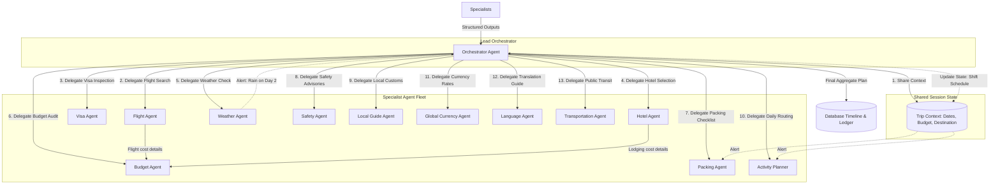
```mermaid
graph TD
    subgraph Lead Orchestrator
        Orchestrator[Orchestrator Agent]
    end
    
    subgraph Shared Session State
        State[(Trip Context: Dates, Budget, Destination)]
    end
    
    Orchestrator <-->|1. Share Context| State
    
    subgraph Specialist Agent Fleet
        Orchestrator -->|2. Delegate Flight Search| Flight[Flight Agent]
        Orchestrator -->|3. Delegate Visa Inspection| Visa[Visa Agent]
        Orchestrator -->|4. Delegate Hotel Selection| Hotel[Hotel Agent]
        Orchestrator -->|5. Delegate Weather Check| Weather[Weather Agent]
        Orchestrator -->|6. Delegate Budget Audit| Budget[Budget Agent]
        Orchestrator -->|7. Delegate Packing Checklist| Packing[Packing Agent]
        Orchestrator -->|8. Delegate Safety Advisories| Safety[Safety Agent]
        Orchestrator -->|9. Delegate Local Customs| Guide[Local Guide Agent]
        Orchestrator -->|10. Delegate Daily Routing| Activity[Activity Planner]
        Orchestrator -->|11. Delegate Currency Rates| Currency[Global Currency Agent]
        Orchestrator -->|12. Delegate Translation Guide| Language[Language Agent]
        Orchestrator -->|13. Delegate Public Transit| Transit[Transportation Agent]
    end
    
    Weather -.->|Alert: Rain on Day 2| Orchestrator
    Orchestrator -.->|Update State: Shift Schedule| State
    State -.->|Alert| Activity
    State -.->|Alert| Packing
    
    Flight -->|Flight cost details| Budget
    Hotel -->|Lodging cost details| Budget
    
    Specialists -->|Structured Outputs| Orchestrator
    Orchestrator -->|Final Aggregate Plan| Final[(Database Timeline & Ledger)]
```

The multi-agent communication diagram shows how the Orchestrator coordinates specialized agents. By using a hub-and-spoke model with shared state, agents can share information and collaborate. For example, if the Weather Agent flags rain, the Activity Planner and Packing Agent automatically adjust their recommendations. Additionally, the Flight and Hotel agents send resolved costs to the Budget Agent to calculate the ledger.

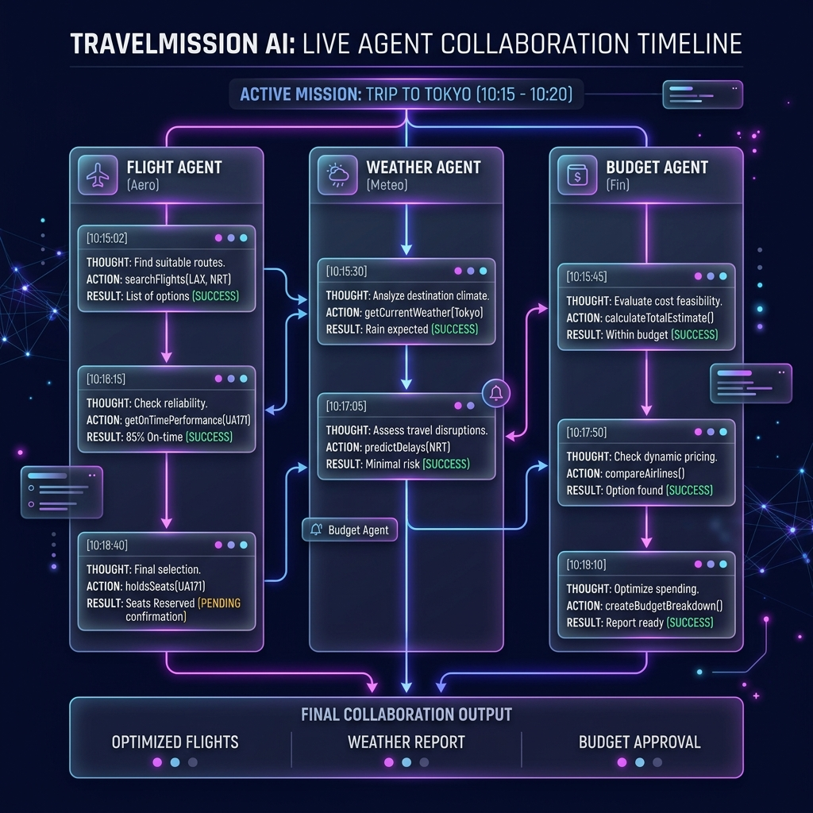

---

### 5. Specialist Agent Fleet Registry

We split tasks across 12 distinct agents, limiting context pollution:

* **Flight Agent**: Scans routes, bags, and ticket classes.
* **Visa Agent**: Audits passports and entry forms via the Filesystem MCP.
* **Hotel Agent**: Selects lodgings based on ratings and transit proximity.
* **Weather Agent**: Monitors forecasts and alerts.
* **Budget Agent**: Audits ledger categories and limits expenses.
* **Packing Agent**: Generates custom packing checklists.
* **Safety Agent**: Tracks advisories, emergency numbers, and hospital networks.
* **Local Guide Agent**: Compiles regional tipping advice, customs, and diners.
* **Activity Planner**: Generates day-by-day morning and evening agendas.
* **Global Currency Agent**: Upgraded service managing live exchange rates, card/cash splits, and trends.
* **Language Agent**: Formulates survival dictionaries and phrase translations.
* **Transportation Agent**: Maps subway lines and transit passes.

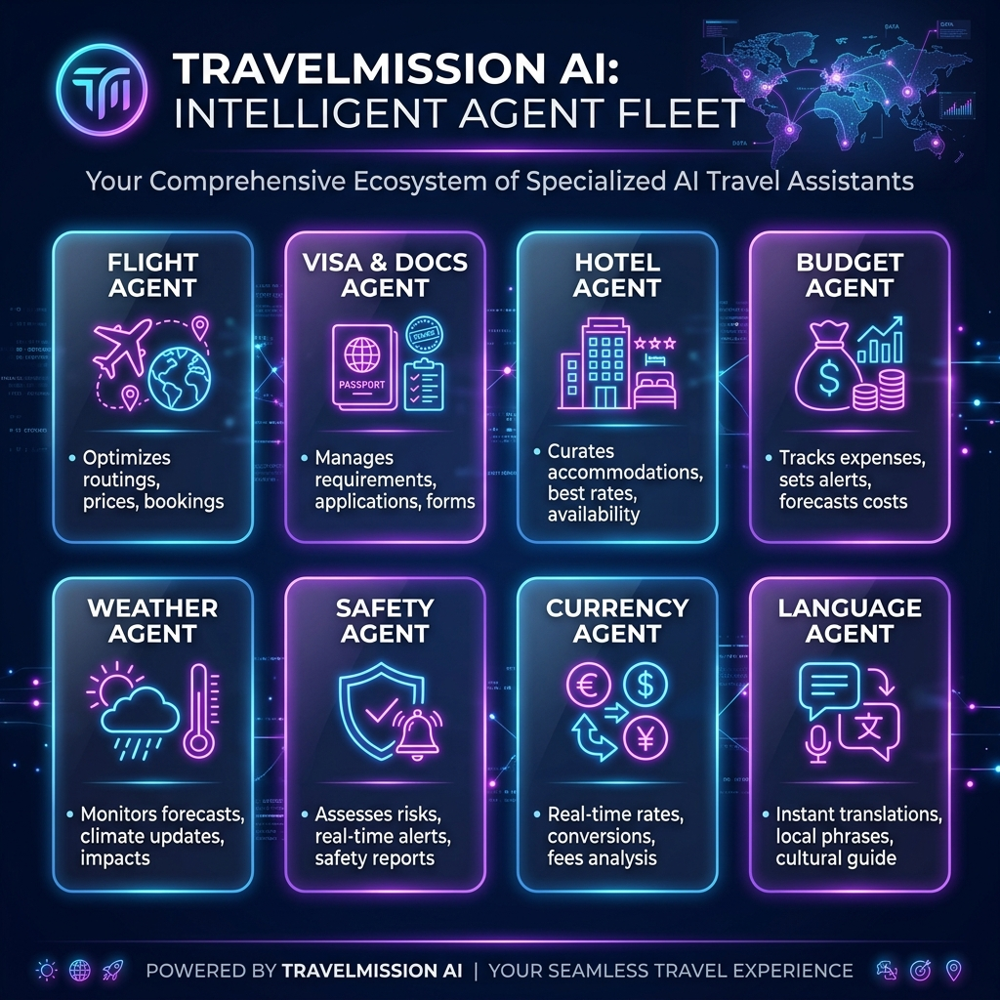

---

## 🔌 MCP Integration

### 6. MCP Architecture Diagram

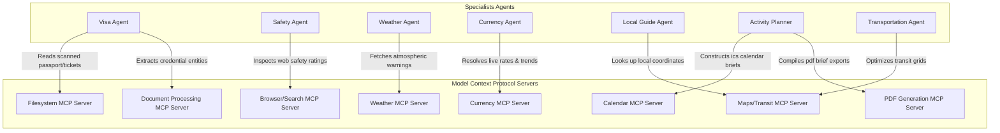
```mermaid
graph TD
    subgraph Specialists Agents
        Visa[Visa Agent]
        Safety[Safety Agent]
        Weather[Weather Agent]
        Currency[Currency Agent]
        Guide[Local Guide Agent]
        Activity[Activity Planner]
        Transit[Transportation Agent]
    end
    
    subgraph Model Context Protocol Servers
        FS_MCP[Filesystem MCP Server]
        Browser_MCP[Browser/Search MCP Server]
        Weather_MCP[Weather MCP Server]
        Currency_MCP[Currency MCP Server]
        Map_MCP[Maps/Transit MCP Server]
        Cal_MCP[Calendar MCP Server]
        PDF_MCP[PDF Generation MCP Server]
        Doc_MCP[Document Processing MCP Server]
    end
    
    Visa -->|Reads scanned passport/tickets| FS_MCP
    Visa -->|Extracts credential entities| Doc_MCP
    
    Safety -->|Inspects web safety ratings| Browser_MCP
    Weather -->|Fetches atmospheric warnings| Weather_MCP
    Currency -->|Resolves live rates & trends| Currency_MCP
    
    Guide -->|Looks up local coordinates| Map_MCP
    Transit -->|Optimizes transit grids| Map_MCP
    
    Activity -->|Constructs ics calendar briefs| Cal_MCP
    Activity -->|Compiles pdf brief exports| PDF_MCP
```

The MCP architecture diagram shows how agents use the Model Context Protocol to access system resources. Stdio-based MCP servers allow the Visa Agent to read files using the Filesystem MCP and extract passport details using the Document Processing MCP. Other servers provide live search, weather feeds, currency rates, maps, and calendar exports.

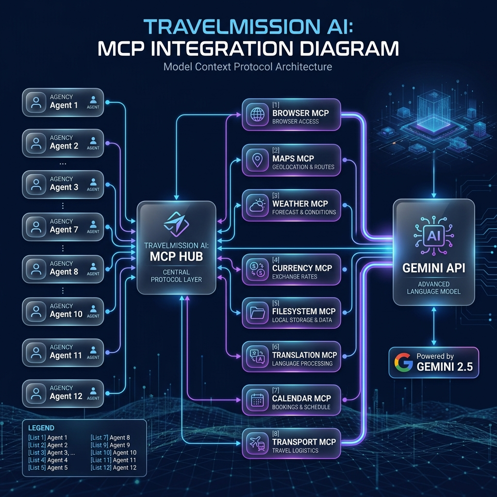

---

## 🧠 Agent Skills

### 7. Agent Skills Diagram


```mermaid
graph TD
    subgraph Specialist Agents
        FlightA[Flight Agent]
        VisaA[Visa Agent]
        HotelA[Hotel Agent]
        WeatherA[Weather Agent]
        BudgetA[Budget Agent]
        PackingA[Packing Agent]
        SafetyA[Safety Agent]
        GuideA[Local Guide Agent]
        ActivityA[Activity Planner]
        CurrencyA[Currency Agent]
        LanguageA[Language Agent]
        TransitA[Transportation Agent]
    end
    
    subgraph Reusable Skill Modules
        FlightSkill[Flight Search Skill]
        HotelSkill[Hotel Recommendation Skill]
        BudgetSkill[Budget Analysis Skill]
        WeatherSkill[Weather Analysis Skill]
        PackingSkill[Packing Recommendation Skill]
        SafetySkill[Safety Assessment Skill]
        CurrencySkill[Currency Conversion Skill]
        LanguageSkill[Translation Skill]
        RouteSkill[Route Optimization Skill]
        VisaSkill[Visa Validation Skill]
    end
    
    FlightA --> FlightSkill
    HotelA --> HotelSkill
    
    VisaA --> VisaSkill
    VisaA --> LanguageSkill
    
    WeatherA --> WeatherSkill
    PackingA --> PackingSkill
    PackingA --> WeatherSkill
    
    BudgetA --> BudgetSkill
    BudgetA --> CurrencySkill
    
    SafetyA --> SafetySkill
    GuideA --> LanguageSkill
    
    ActivityA --> RouteSkill
    ActivityA --> WeatherSkill
    
    CurrencyA --> CurrencySkill
    LanguageA --> LanguageSkill
    TransitA --> RouteSkill
```

The agent skills diagram shows how backend skills are shared across different agents. This modular design keeps agent instructions simple. For example, the Weather Analysis Skill is shared by the Weather Agent, the Packing Agent, and the Activity Planner, allowing them to adapt to forecasts in a consistent manner.

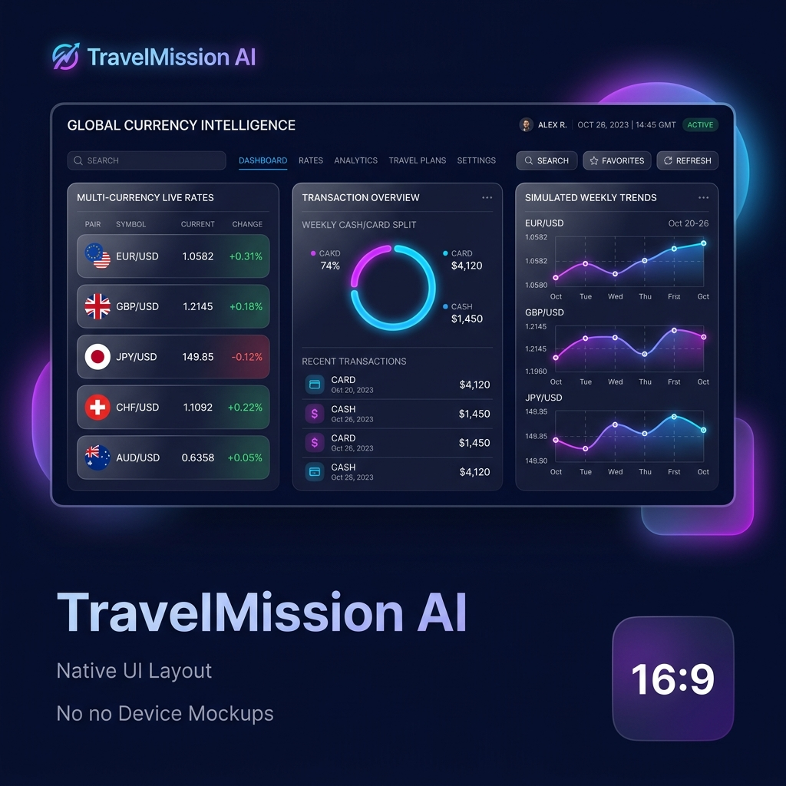

---

## 📦 Deployment & Folder Structure

### 8. Repository Folder Structure

```
travelmission-ai/
├── backend/                  # FastAPI + ADK Backend
│   ├── app/                  # Application files
│   │   ├── agents/           # Specialized agent instructions
│   │   ├── mcp/              # MCP Currency and Filesystem logic
│   │   ├── models.py         # Database models
│   │   └── fast_api_app.py   # Web server and WebSocket gateway
│   ├── pyproject.toml        # Backend dependencies
│   └── Dockerfile            # Backend Docker builder
├── frontend/                 # Next.js Frontend
│   ├── src/
│   │   └── app/
│   │       └── page.tsx      # Dashboard view
│   ├── package.json          # Node dependencies
│   └── Dockerfile            # Frontend production Docker image
├── docs/                     # Technical documentation files
│   ├── architecture.md
│   ├── agent_workflows.md
│   ├── mcp_integration.md
│   ├── agent_skills.md
│   ├── user_workflow.md
│   └── deployment.md
├── docker-compose.yml        # Orchestration script
└── README.md                 # Primary system manual
```

---

### 9. Deployment Topology Diagram

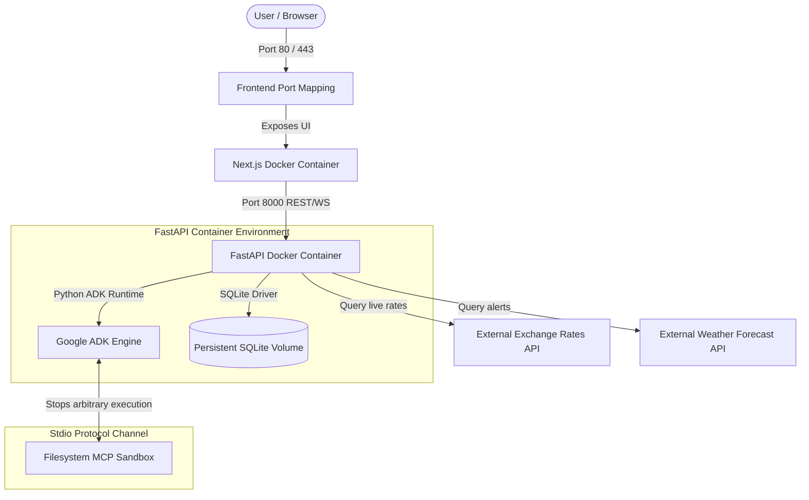
```mermaid
graph TD
    User([User / Browser]) -->|Port 80 / 443| FE_Proxy[Frontend Port Mapping]
    FE_Proxy -->|Exposes UI| FE_Container[Next.js Docker Container]
    
    FE_Container -->|Port 8000 REST/WS| BE_Container[FastAPI Docker Container]
    
    subgraph FastAPI Container Environment
        BE_Container -->|Python ADK Runtime| ADK[Google ADK Engine]
        BE_Container -->|SQLite Driver| DB[(Persistent SQLite Volume)]
    end
    
    subgraph Stdio Protocol Channel
        ADK <-->|Stops arbitrary execution| FS_MCP[Filesystem MCP Sandbox]
    end
    
    BE_Container -->|Query live rates| RatesAPI[External Exchange Rates API]
    BE_Container -->|Query alerts| WeatherAPI[External Weather Forecast API]
```

The deployment diagram shows the containerized production environment. The Next.js frontend container and the FastAPI backend container run on a shared network using Docker Compose. The SQLite database is mounted as a persistent volume, and the Filesystem MCP server runs sandboxed within the backend container, communicating via stdio.

---

## 💾 Installation & Setup

### Prerequisites
1. [Node.js v18+](https://nodejs.org/)
2. [Python 3.11+](https://www.python.org/)
3. [uv](https://github.com/astral-sh/uv) (Python package manager)

### 1. Run Backend Server
```bash
cd backend
# Install dependencies
agents-cli install
# Set API Key (Orchestrator requires Gemini API access)
export GEMINI_API_KEY="your-gemini-key"
# Launch backend server
uv run uvicorn app.fast_api_app:app --host 127.0.0.1 --port 8000
```

### 2. Run Frontend Server
```bash
cd ../frontend
npm install
npm run dev
```
Open `http://localhost:3000` to view the TravelMission AI dashboard!

### 3. Run Containerized Deployment
```bash
docker-compose up --build
```
This runs the frontend at `http://localhost:3000` and the backend API at `http://localhost:8000`.

---

## 🔒 Security & Data Masking

* **Prompt Injection Defense**: Sanitizer utilities check user prompts for injection syntax (e.g. "ignore previous instructions"), rejecting malicious inputs.
* **PII Redaction**: Passport, ID, and ticket uploads are audited, masking birth dates and document numbers before saving them to the database.
* **API Protection & Sandboxing**: All Filesystem MCP operations are sandboxed to a single `/uploads` directory to prevent directory traversal attacks.
* **Rate Limiting**: Integrated `RateLimitMiddleware` limits requests to 60 queries per 60-second window per IP.

---

## 📄 License
This project is licensed under the Apache 2.0 License - see the LICENSE file for details.

## 🤝 Acknowledgements
* Google Vertex AI GenAI team for the Agent Development Kit (ADK).
* Kaggle AI Agents Intensive Capstone coordinators.
