# TravelMission AI: Reusable Agent Skills

This document details the reusable class-based skills defined in the backend and maps which agents leverage them.

---

## 1. Agent Skills Reuse Diagram

```mermaid
graph TD
    subgraph Specialist Agents
        FlightA[Flight Agent]
        VisaA[Visa Agent]
        HotelA[Hotel Agent]
        WeatherA[Weather Agent]
        BudgetA[Budget Agent]
        PackingA[Packing Agent]
        SafetyA[Safety Agent]
        GuideA[Local Guide Agent]
        ActivityA[Activity Planner]
        CurrencyA[Currency Agent]
        LanguageA[Language Agent]
        TransitA[Transportation Agent]
    end
    
    subgraph Reusable Skill Modules
        FlightSkill[Flight Search Skill]
        HotelSkill[Hotel Recommendation Skill]
        BudgetSkill[Budget Analysis Skill]
        WeatherSkill[Weather Analysis Skill]
        PackingSkill[Packing Recommendation Skill]
        SafetySkill[Safety Assessment Skill]
        CurrencySkill[Currency Conversion Skill]
        LanguageSkill[Translation Skill]
        RouteSkill[Route Optimization Skill]
        VisaSkill[Visa Validation Skill]
    end
    
    FlightA --> FlightSkill
    HotelA --> HotelSkill
    
    VisaA --> VisaSkill
    VisaA --> LanguageSkill
    
    WeatherA --> WeatherSkill
    PackingA --> PackingSkill
    PackingA --> WeatherSkill
    
    BudgetA --> BudgetSkill
    BudgetA --> CurrencySkill
    
    SafetyA --> SafetySkill
    GuideA --> LanguageSkill
    
    ActivityA --> RouteSkill
    ActivityA --> WeatherSkill
    
    CurrencyA --> CurrencySkill
    LanguageA --> LanguageSkill
    TransitA --> RouteSkill
```

### Explanatory Analysis
The **Agent Skills Reuse Diagram** illustrates the modular design of TravelMission AI:
* **Separation of Concerns**: Business rules and API calls are isolated in class-based skills (e.g. `FlightSearchSkill`), keeping agent instructions clean and focused.
* **Skill Reuse**: Skills are shared across multiple agents. For example:
  * The **Weather Analysis Skill** is used by the **Weather Agent** to predict rain, by the **Packing Agent** to adjust clothing suggestions, and by the **Activity Planner** to swap outdoor activities for indoor ones.
  * The **Translation Skill** is used by the **Language Agent** for traveler guides and by the **Visa Agent** to parse foreign documents.
  * The **Route Optimization Skill** is used by the **Activity Planner** to order attractions and by the **Transportation Agent** to recommend metro lines.

---

## 2. Skills Registry Detail

| Skill Class Name | Primary Purpose | Reused By |
|------------------|-----------------|-----------|
| **FlightSearchSkill** | Queries flight options, luggage fees, and cheaper dates. | Flight Agent |
| **HotelSelectionSkill** | Evaluates booking rates, hotel safety, and location. | Hotel Agent |
| **BudgetCalculationSkill** | Breaks down categories and estimates total travel costs. | Budget Agent, Orchestrator |
| **WeatherFetchSkill** | Fetches multi-day forecasts and storm flags. | Weather Agent, Packing Agent, Activity Planner |
| **PackingListSkill** | Generates gear checklists based on duration and weather. | Packing Agent |
| **SafetyLookupSkill** | Checks official advisories and emergency numbers. | Safety Agent, Orchestrator |
| **CurrencyExchangeSkill** | Resolves live rates, ATM surcharges, and payment tips. | Currency Agent, Budget Agent |
| **LocalEtiquetteSkill** | Guides on tipping rules, diners, and customs. | Local Guide Agent |
| **LocalTransportSkill** | Recommends passes, shuttle routes, and walking pathways. | Transportation Agent, Activity Planner |
| **VisaRequirementSkill** | Audits entry rules and passport validity limits. | Visa Agent |
| **DocumentParsingSkill** | Executes secure OCR scanning and masks sensitive data. | Visa Agent, Orchestrator |
