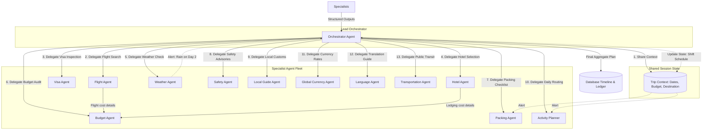

# TravelMission AI: Multi-Agent Workflows & Collaboration

This document explains the multi-agent collaboration, delegation, and context sharing protocols used by the Orchestrator and the 12 specialized agents.

---

## 1. Multi-Agent Communication Diagram

### Explanatory Analysis
The **Multi-Agent Communication Diagram** showcases the coordination flow of TravelMission AI. Rather than having a flat list of agents, the system operates as a **hub-and-spoke model** with a **Shared Session State**:
1. **Agent Delegation**: The Orchestrator assigns specific responsibilities to specialized agents (e.g., the Flight Agent focuses solely on finding routes, while the Language Agent compiles translation guides). This limits context pollution and prevents LLM tool-calling hallucinations.
2. **Inter-agent Collaboration**: Agents collaborate through state updates. For instance, the **Flight Agent** and **Hotel Agent** post their resolved costs to the shared budget state, which the **Budget Agent** reads to compile the final ledger.
3. **Shared Context**: When the **Weather Agent** flags a storm on Day 2, this warning is updated in the shared state. This alerts the **Activity Planner** to reschedule outdoor hikes to indoor museums and prompts the **Packing Agent** to add umbrellas to the checklist.
4. **Structured Outputs & Aggregation**: Each agent outputs structured JSON which the Orchestrator validates and aggregates into the database.

---

## 2. Agent Operational Roles

The 12 specialized agents possess distinct instructions, tools, and responsibilities:

| Agent Name | Operational Role | Key Tools & MCP Integrations |
|------------|------------------|------------------------------|
| **Orchestrator** | Coordinates execution, manages state, and aggregates data. | `runner.session_service` |
| **Flight Agent** | Researches flight options, prices, and bags. | `search_flights_tool` |
| **Visa Agent** | Audits entry requirements and passport validity. | `check_visa_requirements_tool`, `filesystem_mcp` |
| **Hotel Agent** | Evaluates boutique lodgings and safety ratings. | `search_hotels_tool` |
| **Weather Agent** | Monitors weather forecasts and storms. | `get_weather_forecast_tool` |
| **Budget Agent** | Estimates and balances total trip expenditures. | `calculate_budget_tool` |
| **Packing Agent** | Compiles custom clothing and utility checklists. | `get_packing_suggestions_tool` |
| **Safety Agent** | Tracks official safety advisories and emergency lines. | `get_safety_advisory_tool` |
| **Local Guide Agent** | Curates cultural customs, tipping etiquette, and diners. | `get_local_guide_tips_tool` |
| **Activity Planner** | Schedules day-by-day morning/evening agendas. | Route optimization heuristics |
| **Global Currency Agent** | Manages exchange rates, alerts, and cashless tips. | `get_currency_exchange_rate_tool` |
| **Language Agent** | Translates survival phrases and pronunciations. | `translate_text_tool` |
| **Transportation Agent** | Recommends subways, metro passes, and walking routes. | `get_local_transport_options_tool` |
