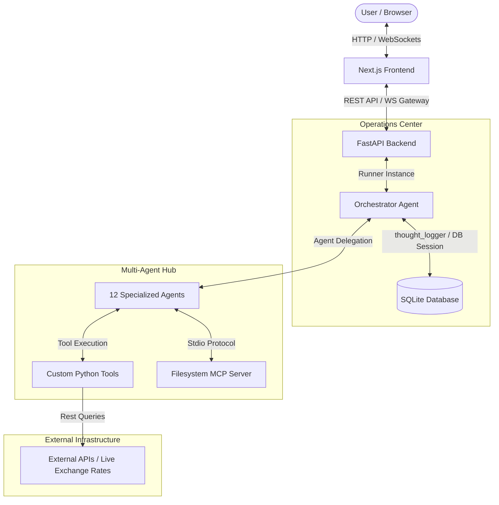
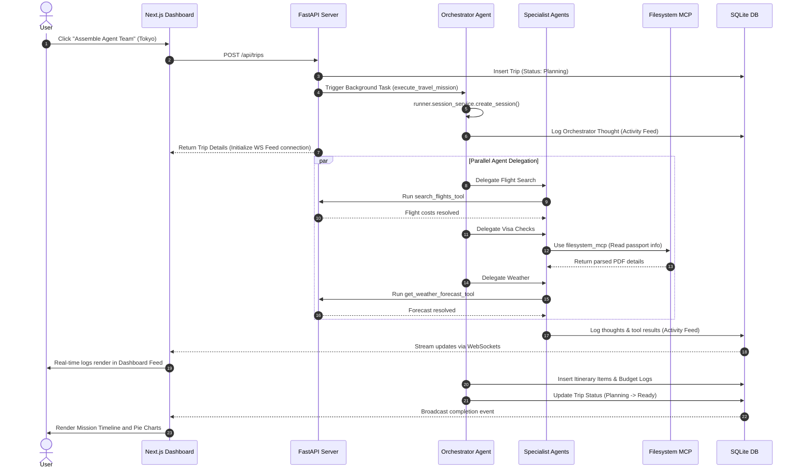
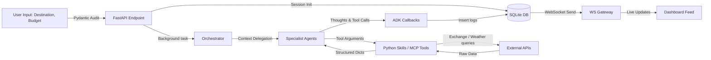

# TravelMission AI: System Architecture & Data Flow

This document details the overall system architecture, runtime sequences, and data flow pathways of TravelMission AI.

---

## 1. System Architecture

### Explanatory Analysis
The **Overall System Architecture** follows a modern full-stack decoupled model optimized for multi-agent coordination. The **Next.js Frontend** serves a glassmorphic dashboard that communicates with the **FastAPI Backend** using REST endpoints for command triggers and a bi-directional **WebSocket Event Gateway** for real-time operations streaming. 

The backend instantiates the **Google ADK Orchestrator Agent**, which acts as the central brain. It delegates operations to **12 specialized agents**, which are isolated reasoners. These agents invoke specific **Custom Python Tools** (for live exchange rates, weather, and budget metrics) or connect via standard stdio to the **Filesystem MCP Server** to read user-uploaded travel briefs, write logs, and persist trip schedules in the local **SQLite Database**.

---

## 2. Sequence Diagram

### Explanatory Analysis
The **Sequence Diagram** illustrates the end-to-end execution path when a traveler launches a new travel mission. The backend immediately returns the database record to let the frontend open a real-time WebSocket connection to stream logs. 

In the background, the Orchestrator initiates an ADK session and delegates tasks in parallel to specialized agents (e.g. Flight, Visa, and Weather agents). The Visa Agent utilizes the stdio-based `filesystem_mcp` server to inspect uploaded travel credentials. Every thought, tool call, and result is committed to the database and pushed to the client browser in real time. Finally, the Orchestrator aggregates the results, populates the itinerary and budget log tables, and changes the trip status to `Ready`.

---

## 3. Data Flow Diagram

### Explanatory Analysis
The **Data Flow Diagram** shows how data propagates through the system. Raw inputs are first audited by **Pydantic Schemas** to prevent SQL injection or rate-limit exploits. Once sanitized, data is stored in the **SQLite DB** and sent to the **Orchestrator**. 

The Orchestrator shares this context with the **Specialist Agents**. The agents invoke **Python Skills** and **MCP Tools**, calling **External APIs** to fetch weather and exchange rates. The raw JSON is structured into typed dicts by the skills and returned to the agents. The ADK callbacks record the step logs in the database, which triggers the **WebSocket Gateway** to push updates to the user's dashboard.
