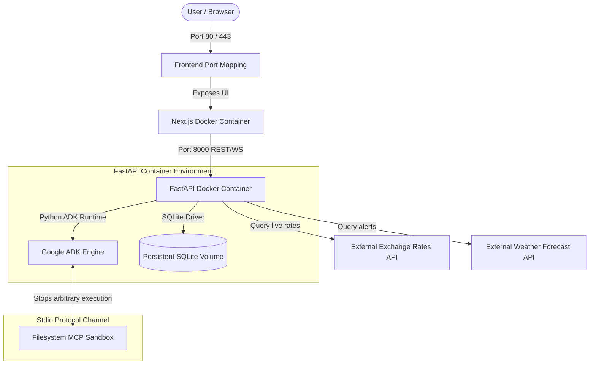

# TravelMission AI: Folder Structure & Deployment Guide

This document describes the directory tree structure of the repository, the Docker multi-container topology, and production deployment parameters.

---

## 1. Folder Structure Tree

```
travelmission-ai/
├── backend/                  # FastAPI / Python Backend Service
│   ├── app/                  # Main Application logic
│   │   ├── agents/           # Specialized Agent instructions (specialists.py)
│   │   ├── mcp/              # MCP Currency and Filesystem integrations
│   │   ├── models.py         # SQLAlchemy Database models (SQLAlchemy ORM)
│   │   ├── schemas/          # Pydantic Schemas for Trip API
│   │   ├── tools/            # Custom Python tools (travel_tools.py)
│   │   └── fast_api_app.py   # FastAPI server endpoints and WebSocket gateway
│   ├── pyproject.toml        # Backend dependencies and quality tooling (uv sync)
│   └── Dockerfile            # Python backend container build config
├── frontend/                 # Next.js Frontend Web Application
│   ├── src/
│   │   └── app/
│   │       ├── page.tsx      # Mission Control Dashboard component
│   │       └── layout.tsx    # Next.js page layout
│   ├── package.json          # Node dependencies (Next.js, Recharts, Framer Motion)
│   └── Dockerfile            # Multi-stage production node builder
├── docs/                     # Comprehensive Capstone documentation
│   ├── architecture.md       # Core systems and sequences
│   ├── agent_workflows.md    # Multi-agent coordination protocols
│   ├── mcp_integration.md    # Model Context Protocol details
│   ├── agent_skills.md       # Reusable agent skills
│   ├── user_workflow.md      # User journeys and tabs
│   └── deployment.md         # Deployment and directory structure
├── docker-compose.yml        # Multi-container local orchestration script
├── README.md                 # Primary entrypoint documentation
└── .env.example              # Development environment parameters template
```

---

## 2. Deployment Topology Diagram



### Explanatory Analysis
The **Deployment Diagram** illustrates how the application runs in a containerized environment using **Docker Compose**:
1. **Frontend Container**: Builds a multi-stage **Next.js** bundle, serving static assets and dynamic React interfaces.
2. **Backend Container**: Runs the **FastAPI** server using Python `uv`. The agent loop runs asynchronously in background threads.
3. **Database Volume**: SQLite is configured as a persistent volume mapping to the host system (`/backend/travel_mission.db`), ensuring trip details and agent logs survive container restarts.
4. **Sandboxed MCP**: The Filesystem MCP runs as a sandboxed helper within the backend container, communicating via stdio to prevent security leaks.
5. **External API Outbound Calls**: The backend container routes outbound queries to weather and currency exchange APIs.
