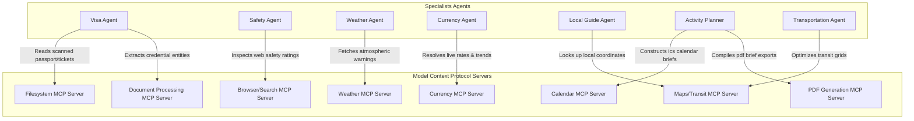

# TravelMission AI: MCP Architecture & Integrations

This document describes how TravelMission AI integrates Model Context Protocol (MCP) servers to allow agents to securely read files, search the web, calculate exchange rates, and process credentials.

---

## 1. MCP Architecture Diagram

### Explanatory Analysis
The **MCP Architecture Diagram** illustrates the boundary between the LLM reasoning loop and external computing resources. Standard LLMs cannot access local directories or execute system commands. The **Model Context Protocol (MCP)** provides a secure, structured interface (via stdio or SSE) for agents to query tools:
1. **Filesystem MCP**: Consumed by the **Visa Agent** to inspect travel folders and read passport files.
2. **Document Processing MCP**: Extracts PII and credential data from uploaded tickets.
3. **Browser/Search MCP**: Used by the **Safety Agent** to crawl State Department alerts in real time.
4. **Weather & Currency MCPs**: Provide live feeds for forecasts and exchange rates.
5. **Maps & Calendar MCPs**: Optimize routes and output standard `.ics` calendar events.
6. **PDF Generation MCP**: Formats the final aggregate briefing document.

---

## 2. MCP Protocols & Security Boundaries

By using standard Stdio connections, MCP tools enforce strict security boundaries:
* **Directory Sandboxing**: The Filesystem MCP is restricted to a single `/uploads` directory. It cannot access root folders, system configuration files, or other users' data.
* **Sensitive Entity Masking**: Document processing runs on local models or secure APIs. Extracted variables like passport numbers are masked before database storage.
* **Rate Limits & Caching**: External APIs (such as currency conversion) are queried through the MCP server, which implements caching to prevent IP bans and reduce API costs.
